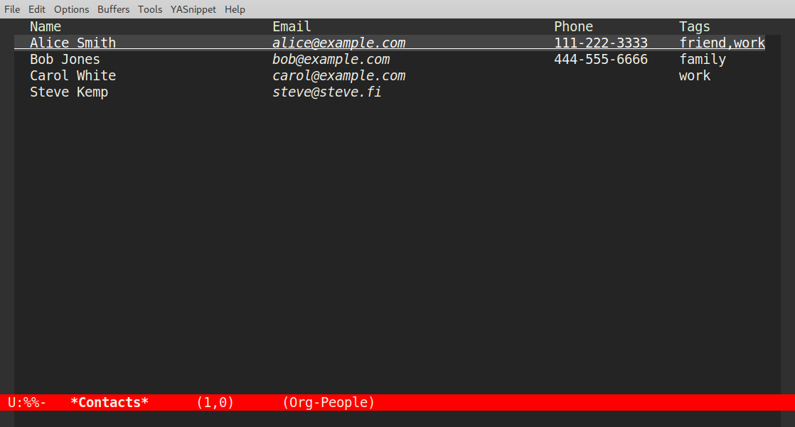
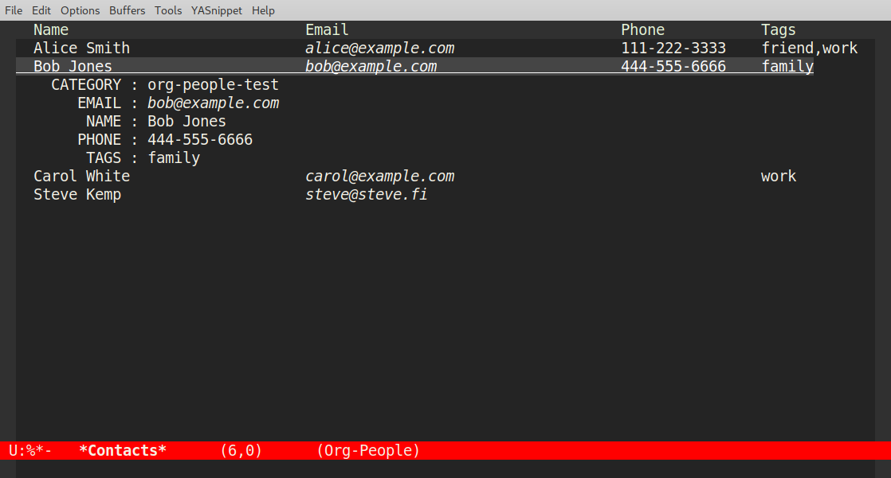

# org-people

This package allows easy contact-management and inspection via native org-mode facilities.

People can be discovered from specific named files, and if none are specified then they
are discovered within each of your org-agenda files (i.e. We default to the files listed in `org-agenda-files`).

* People names are expected to be headlines.
* With data about them stored in property drawers.

This is an example of a pair of contacts, and you can see more within the
[test/org-people-test.org](https://raw.githubusercontent.com/skx/org-people/refs/heads/main/test/org-people-test.org) file:

```
* People
  ** Alice                           :family:contact:
  :PROPERTIES:
  :ADDRESS: 32 Something Street
  :EMAIL: alice@example.com
  :PHONE: +123 456 789
  :CHILDREN: Mallory
  :NICKNAME: Allu
  :END:
 ** Bob                           :colleague:contact:
  :PROPERTIES:
  :ADDRESS: 32 Something Lane
  :EMAIL: bob@example.com
  :PHONE: +123 456 987
  :END:
```


### Default Properties

It is assumed that you'll have "`ADDRESS`", "`EMAIL`", "`PHONE`", and other similar properties - but you can add as many properties as you wish and later retrieve/view them.   So long as there is a `contact` tag and at least one property then the entry will be recognized.

The package doesn't mandate the use of any specific properties, however there are a couple of properties which get special handling:

* If `:NICKNAME` is present it will be offered a completion-target.
* If `:WEBSITE` is present it will be used when contact-links are exported to HTML.

The summary view of all known contacts (`M-x org-people-summary`), and the CSV/vCARD exportors, will default to using the `ADDRESS`, `EMAIL`, and `PHONE` properties, however these can be changed.


## Screenshots

Here's the default view, a list of contacts showing `:NAME`, `:EMAIL`, `:PHONE` and `:TAGS`:



I've enabled `hl-line-mode` here, to highlight the current row, which is an optional enhancement.  Within the list you can mark [multiple] people and apply operations to them, for example opening
the `:WEBSITE` of each person.




## Installation / Configuration Example

The legacy way to install would be to clone this repository and ensure the directory is available upon your load-path, or copy your local lisp tree.  The package is available upon MELPA, and can be installed from there in the standard way.

Suggested usage if you're using the traditional approach:

```
(require 'org-people)

; insert a contact "thing" at the current point.
(global-set-key (kbd "C-c p") 'org-people-insert)

; Show a table of all known contacts.  The table is sortable, filterable, & etc.
(global-set-key (kbd "C-c P") 'org-people-summary)
```

If you prefer `use-package` then this works:

```
(use-package org-people
  :after org
  :bind
    (("C-c p" . org-people-insert)
     ("C-c P" . org-people-summary))
  :hook
    (org-people-summary-mode . hl-line-mode))
```

That block enables `hl-line-mode` within the summary-buffer, which has special support to only highlight people-names rather than any inline property values.  To enable this manually you could use this:

```
(add-hook 'org-people-summary-mode-hook #'(lambda () (hl-line-mode 1)))
```


## Alternatives

This package is pretty new, and there are several existing packages with overlapping functionality you might wish to compare against.

* [org-contacts](https://github.com/emacsmirror/org-contacts)
  * Stable for many years.  It has integration with IRC, rmail, etc
  * Defines a custom link-type `org-contact:XXX` similar to the `org-people:XXX` this package supports.
  * However org-contacts has nothing like our summary-view, and feels more like a fancy auto-completion framework.
* [org-vcard](https://github.com/pinoaffe/org-vcard)
  * Much more complete support for export, and has import too (org-people has no input facilities).
  * Assumes people-data is stored in [sub]headlines, rather than properties.
  * Limited additional functionality.

The main difference between this package and others I looked at is the interactive summary-view, which allows showing all known people in a flexible way, with sorting, filtering & etc.  This package also has the utility functions for generating/maintaining `org-mode` tables populated with contacts, or their details.


## Adding Entries

If you use `org-capture` you may use the following template to add a new entry:

```
(setq org-capture-templates
  (append org-capture-templates
       '(("p" "People" entry (file+headline "~/Private/Org/PEOPLE.org" "People")
          "* %^{Name}\n:PROPERTIES:\n:EMAIL: %^{Email}\n:PHONE: %^{Phone}\n:END:\n%?"
         :empty-lines 1))))
```


## API / Functions

These are the main user-focused functions within the package to work with contacts:

* `org-people-insert`
  * Insert contact-data, via interactive prompts (with `completing-read`).
* `org-people-summary`
  * Parse all known contacts and pop to a buffer containing a summary of their details.
  * This uses `tabulated-list-mode` and is documented further below.
    * But in brief you can mark, filter, and adjust columns and their contents pretty flexibly.
* `org-people-tags-to-table`
  * Designed to create auto-updating tables inside `org-mode` documents.
* `org-people-person-to-table`
  * Designed to create auto-updating tables inside `org-mode` documents.


## Configuration

No special configuration is required, although if you wish to use a different tag to identify the contacts you may specify that via `org-people-search-tag`.  Similarly many of the default operations may be updated via the appropriate configuration values, and these are documented within the package itself.

If you wished to limit parsing to only named file(s) you could set `org-people-search-type` to be a list containing the path(s) to process.  Otherwise all agenda-files will be read.

The configuration of the columns, within the `org-people-summary` view, has been expanded in recent releases.  Rather than only allowing a name/width to be specified you may now add optional configuration to override the column names, the width and even the function which populates the value.  This allows you to create dynamic values.  For example see the last two items here:

```
(setq org-people-summary-properties
      '((:NAME  :width 25)
        (:EMAIL :width 30)
        :TAGS
        (:PHONE :width 15 :title "Digits")
        (:MEOW  :getter (lambda (plist) (concat (plist-get plist :COUNTRY) " [" (plist-get plist :FLAG) "]" )))))
```


## Limitations

If you have two contacts with the same name one will overwrite the other.  This is annoying, but not a bug.


## org-mode links

This package defines a custom `org-mode` link-type for the `org-people:` protocol, which will jump to the definition of the given contact when clicked/followed.   You can add such a link via `C-c C-l`, as expected, and you'll find TAB completion works for populating the protocol-name, and the person's name.  The description will default to their name too.

A link might look like this for example:

    * This is a headline

    [[org-people:Steve Kemp]] wrote this package.

When exported to HTML the contact name will be converted to a hyperlink pointing to the user's `:WEBSITE` property, if present, otherwise it will be left unchanged.

The utility function `org-people-add-descriptions` will update all `org-people:` links within the current document to ensure the description matches the link target, which makes the display more readable.


## Completion Functions

There are a pair of functions provided for the complete-at-point functionality:

* `org-people-capf`
  * Complete contact names.  (e.g. `Alice Smith`)
* `org-people-email-capf`
  * Complete contact emails. (e.g. `"Mallory Jones" <foo@bar.com>"`).

They might be enabled like so using the standard `capf`:

    (add-hook 'message-mode-hook
          (lambda ()
            (add-hook 'completion-at-point-functions
                      #'org-people-email-capf
                      nil t)))

    (add-hook 'text-mode-hook
          (lambda ()
            (add-hook 'completion-at-point-functions
                      #'org-people-capf
                      nil t)))


## Dynamic `org-mode` tables

If you tag the contacts with more than just the `contacts` value then you may use those tags to build simple tables of matching entries.  For example the following can auto-update:

    #+NAME: get-family-contacts
    #+BEGIN_SRC elisp :results value table
    (org-people-tags-to-table "family")
    #+END_SRC

If you prefer to include different columns in your generated table you can specify them directly:

    #+NAME: get-family-contacts
    #+BEGIN_SRC elisp :results value table
    (org-people-tags-to-table "family" '(:LINK :PHONE))
    #+END_SRC

You may also create a table including all known data about a single named individual:

    #+NAME: steve-kemp
    #+BEGIN_SRC elisp :results value table :colnames '("Field" "Value")
    (org-people-person-to-table "Steve Kemp")
    #+END_SRC

    #+RESULTS: steve-kemp
    | Field       | Value                                   |
    |-------------+-----------------------------------------|
    | Address     | Helsinki, Finland                       |
    | Category    | PEOPLE                                  |
    | Country     | Finland                                 |
    | Email       | steve@steve.fi                          |
    | Name        | Steve Kemp                              |
    | Phone       | +358123456789                           |
    | Tags        | (me)                                    |

In this case properties listed in `org-people-ignored-properties` will be ignored and excluded from the generated table.


## Summary View

The `org-people-summary` function shows a table of all your known contacts.

You can customize the displayed fields, or their order, by modifying the `org-people-summary-properties` variable, as noted earlier in this documentation.  The default setting is to show the name, email, phone-number and tags associated with each entry.

> **NOTE**: If a given column would be 100% empty (i.e. no known contacts have a property with that name) then the column will be removed from display.

Some keybindings are setup in the `org-people-summary-mode-map`, everything will be visible if you press `?`.

In brief though:

* `RET` jump to the definition of the contact.
* `c` Copy the field under the point.
* `f` Filter the view, by property.
  * Even properties which are not visible can be used.
  * e.g. ":ADDRESS" "Finland" will show only Finnish residents.
* `r` reset the state of columns.
* `R` clear the cache, reload all agenda files, and refresh the display.
* `s` Initiate a search forward, via `isearch-forward`.
* `t` Toggle visibility of a named column.
* `T` Hide the current column.
* `v` - Export the current contact, or all marked contacts, to vCARD format.
* `C` - Export the current contact, or all marked contacts, to CSV.

People may be marked with `m` (the current row), or `M` (all rows), and unmarked with `u` (current row), or `U` (all rows).  There are a couple of functions which operate upon all marked rows:

* CSV Export (bound to `C` by default).
* Email user(s) (bound to `e` by default).
* Open website(s) of user(s) (bound to `w` by default).
* vCARD Export (bound to `C` by default).

For simplicity you can toggle the display of known properties inline via `TAB`, which avoids the need to leave the view to see them.  (Otherwise `RET` and jumping to their definition would be the thing to do.)


### Coding Summary Additions

The `org-people-summary-marked-or-current` function to allow you to easily define your own custom routines that can operate either on:

* The contact on the row containing the point.
* The arbitrary number of marked people.
  * Marks being set with `m`/`M` and cleared with `u`/`U`.

This is a brief example:

    (defun show-marked-users ()
      "Proof of concept to show the names of marked people.
    If no people are marked show the name of the person in the row
    containing the point."
      (interactive)
      (org-people-summary-marked-or-current
         (lambda (name) (message "called with person: %s" name))))

    (define-key org-people-summary-mode-map (kbd "x") #'show-marked-users)


## Testing The Code

You can run `make test` via the supplied [Makefile](Makefile) to run the tests in a batch-mode, otherwise load the file [org-people-test.el](org-people-test.el) and run `M-x eval buffer`, you should see the test results in a new buffer.

If any tests fail that's a bug.


## Release Process

The package uses semantic versioning, and labeling.

Whenever a [pull request](https://github.com/skx/org-people/pulls) is merged a new release is automatically tagged, and our [org-people.el](org-people.el) file is automatically updated to include the new version number.

This magic is handled via `release.yml` located within our [github actions directory](.github/workflows/).
